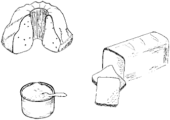

<!--

author:   Andre Dietrich
email:    dietrich@ivs.cs.uni-magdeburg.de
version:  1.0.0
language: en_US
narrator: Deutsch Female

script:   https://cdn.rawgit.com/liaScript/tau-prolog_template/master/js/tau-prolog.js

@tau_prolog_program
<script>
    window['@0'] = {session: window.pl.create(), query: null, rslt: "", query_str: ""};
    var c = window['@0']['session'].consult(`{X}`);
    if( c !== true )
        throw {message: "parsing program '@0' => " + c.args[0]};
    else
        "database '@0' loaded";
</script>
@end

@tau_prolog_query
<script>
    var query = `{X}`;

    try {
        if(window['@0']['query'] == null || window['@0']['query_str'] != query) {
            window['@0']['query_str'] = query;
            window['@0']['rslt'] = "";
            window['@0']['query'] = window['@0']['session'].query(query);
        }
    }
    catch(e) {
        throw {message: "'@0' has not been consulted"};
    }

    if( window['@0']['query'] !== true ) {
        throw {message: "parsing query for '@0' => " + window['@0']['query'].args[0]};
    }
    else {
        var callback = function(answer) {
            window['@0']['rslt'] +=  window.pl.format_answer( answer ) + "<br>";
        };
        window['@0']['session'].answer(callback);

        window['@0']['rslt'];
    }
</script>
@end


@tau_prolog
```prolog
@2
```
@tau_prolog_program(@0)


```prolog
@1
```
@tau_prolog_query(@0)
@end


script:   https://unpkg.com/mermaid@7.1.0/dist/mermaid.min.js

@mermaid
<script>
  mermaid.initialize({});

  mermaid.render("id@0",
                 `@1`,
                 function(svgCode) {
                     var elem = document.getElementById("id@0");
                     elem.innerHTML = svgCode;
                     elem.firstChild.style.height = elem.getAttribute('viewbox').split(' ')[3] + 'px';
                 });
</script>
<span class="mermaid" id="id@0"></span>
@end

@mermaid_eval
<script>
var elem = document.getElementById('id@0');

if(elem != null)
  elem.remove();

mermaid.initialize({});
var graphDefinition = `{X}`
var cb = function(svgGraph) {
    return true;
}
mermaid.render('id@0',graphDefinition,cb)
</script>
@end


-->

# Arbeitsbuch PROLOG

Template for integrating the Tau-Prolog interpreter into LiaScript


## Originales Vorwort

Dieses Buch soll in die Programmiersprache PROLOG und in die mit ihr verbundene
'Logik-programmierung' einführen. Die Idee, 'Logik als eine Programmiersprache'
zu verwenden, führt zu einer völlig neuen Auffassung vom Programmieren: Das
Programm ist nicht eine Folge von Handlungsanweisungen, sondern eine Sammlung
von Fakten und Regeln. Das zu lösende Problem wird als eine Anfrage an diese
Sammlung formuliert. Im Idealfall führt die logisch korrekte Formulierung der
Regeln und der Anfrage zur Lösung des Problems.

Dieser Ansatz ist faszinierend, und das allein schon wäre Grund genug, PROLOG
als zweite Programmiersprache für die Schule in Betracht zu ziehen. Hinzu kommen
aber noch andere Vorteile:

* Die Beschäftigung mit einer Sprache, die sich völlig von den
  befehlsorientierten Sprachen wie PASCAL unterscheidet, weitet den Horizont;
  altbekannte Algorithmen erscheinen in einem neuen Licht und neuartige Probleme
  können behandelt werden.
* Die wesentlichen Grundelemente von PROLOG bilden eine kleine, überschaubare
  Menge. (Sie zu beherrschen ist allerdings nicht ganz einfach.)
* Der aktive Umgang mit logischen, deklarativen Programmen fördert (so hoffen
  wir) das logische Denken.

Den letzten Punkt halten wir für entscheidend; daher haben wir uns in diesem
Buch sehr stark auf den logischen Kern der Sprache – auf 'pures' PROLOG –
beschränkt (und nehmen eine etwas spartanische 'Oberfläche' in Kauf). Es geht
uns nicht um die möglichst umfassende Vermittlung der Programmiersprache,
sondern um das Bekanntmachen eines neuen, mächtigen und schönen
Programmierkonzeptes. Zum Vertrautwerden mit diesem neuen Konzept bedarf es
vieler sinnvoller Beispiele und Aufgaben; wir hoffen, hier genügend
bereitgestellt zu haben.

Das Buch besteht im wesentlichen aus zwei Teilen. Der erste Teil gibt eine
Einführung in die Arbeitsweise von PROLOG, das grundlegende Verfahren der
Rekursion und den Datentyp der Liste. Der zweite Teil besteht aus elf
Vertiefungen; diese sind weitgehend unabhängig voneinander und nach steigender
Komplexität geordnet. Für einen Kurs schlagen wir vor, zuerst den ersten Teil
(evtl. ohne Kapitel 7) und dann mindestens eine Vertiefung durchzuarbeiten. Ein
'Schnupperkurs' von wenigen Stunden (vielleicht schon in Sekundarstufe I) könnte
aus Kapitel 1 und 2, dem Anfang von Kapitel 3 und der Vertiefung B, der
Datenbasisprogrammierung, bestehen. Bei Bedarf könnte dies noch mit einigen
Rätseln aus Vertiefung A gewürzt werden.

Wir verwenden PROLOG nach dem sogenannten Edinburgh-Standard, der durch das Buch
von CLOCKSIN und MELLISH definiert wurde und sich inzwischen weitgehend
durchgesetzt hat. In Versionen, die sich nach diesem Standard richten, laufen
die Programme des Buches problemlos. Für einige gängige Versionen sind gezielte
Hinweise im Anhang gegeben. Dort findet man auch Hinweise auf die Bezugsquellen.

Wir bedanken uns bei dem Herausgeber, Herrn StD Dietrich Pohlmann, für
zahlreiche Anregungen und Verbesserungsvorschläge und beim Verlag Ferd. Dümmler
für die freundliche Betreuung. Wir danken weiterhin Ingrid Hafenbrak für die
Illustrationen, Frau Sylvia Platz und Herrn Martin Kammerer für die Hilfe bei
der Gestaltung des Manuskriptes und Herrn Dr. Klaus Scheler für das sorgfältige
Korrekturlesen. Schließlich gilt unser Dank den Mannheimer Schülern und Lehrern
vom Elisabeth Gymnasium und vom Gymnasium Feudenheim, die uns ermöglichten,
unsere Ideen in der Schulpraxis zu erproben.

Es freut uns, dass nach recht kurzer Zeit eine Neuauflage erforderlich wurde.
Dabei wurden nur einige Druckfehler und Unstimmigkeiten berichtigt; die beiden
Auflagen sind also uneingeschränkt nebeneinander im Unterricht einsetzbar.
Heidelberg und Weingarten

Hartmut Göhner, Bernd Hafenbrak

Wir bedanken uns bei den beiden Autoren, die dem Landesinstitut für Schule und
Ausbildung Mecklenburg-Vorpommern (L.I.S.A.) die Texte und Programme zur
Verfügung stellten, damit wir das – leider vergriffene – Arbeitsbuch PROLOG in
den Landesbildungsserver einstellen konnten. Schwerin

Gabriele Lehmann

## Grundlagen

### Willkommen

                            --{{0}}--
Einen kleinen Blumenstrauß zu beginn.

<!-- style="max-width: 100%;" -->

                            --{{1}}--
Dieses Buch ist leider im original nicht im Vierfarbendruck erscheinen aber wir
können den Willkommensstrauß auch kurz mit einfachen Worten wie:

                              {{1}}
* Die Rose ist rot.
* Die Tulpe ist gelb.
* Die Nelke ist weiß.
* Das Vergißmeinnicht ist blau.
* Das Veilchen ist blau.
<!-- --{{1}}-- Die Rose ist rot, die Tulpe ist gelb oder das Veilchen ist blau. -->

#### PROLOG-Notation

                            --{{0}}--
Solche **Fakten** (Tatsachen) wie die Zusammensetzung eines Straußes können in
PROLOG wie folgt abgebildet werden:


```prolog
rot(rose).
gelb(tulpe).
weiss(nelke).
blau(vergissmeinnicht).
blau(veilchen).
```

                            --{{1}}--
Die **Prädikate** (Eigenschaften) *rot*, *gelb*, *weiss* und *blau* treffen auf
gewisse Konstanten wie zum Beispiel *rose* zu, dies schreiben wir in der obigen
Form. Sowohl Prädikate als auch Konstanten werden mit kleinem Anfangsbuchstaben
geschrieben, deutsche Sonderzeichen vermeiden wir. Jedes Faktum wird mit einem
Punkt und dem Drücken der RETURN-Taste abgeschlossen.

#### PROLOG-Programme

                                 --{{0}}--
Die hier genuzte PROLOG-IDE besteht immer aus zwei Teilen, einer Eingabe für das
Programm. Wenn du hier auf Ausführen klickst, so wird dieses Programm geladen.
Da dieses Programm jedoch einen syntaktischen Fehler hat, erhältst du zunächst
eine Fehlermeldung, die auf ein Syntax-Problem hinweist.

                                 --{{1}}--
Mit einem Doppel-Klick auf den Code gelangst du in den Editiermodus und kannst
den fehlenden Punkt am Ende der letzten Zeile einfügen. Wenn du dann wieder auf
Ausführen klickst, so wird dir angezeigt, dass deine Datenbasis erfolgreich
geladen werden konnte.

```prolog
rot(rose).
gelb(tulpe).
weiss(nelke).
blau(vergissmeinnicht).
blau(veilchen)
```
@tau_prolog_program(blumenstrauss.pl)

                             --{{2}}--
Um anfragen an deine Datenbasis zu stellen, benötigst du noch eine zweite
Eingabemöglichkeit:

    {{2-4}}
```prolog
rot(rose).
```
@tau_prolog_query(blumenstrauss.pl)

                          --{{3}}--
Solche Eingaben werden als Fragen aufgefasst. Umgangsprachlich formuliert heißt
das: "Ist die Rose rot?". Als Antwort erscheint `true`.

                     --{{4}}--
Und auf die Frage `gelb(veilchen).` erhalten wir `false`. Versuch weitere
solcher Fragen einzugeben. Du wirst sehen: Kommt die Frage buchstabengetreu als
Faktum in der Datenbasis vor, so antwortet PROLOG mit `true`, andernfalls mit
`false`.

{{4}}
```prolog
gelb(veilchen).
```
@tau_prolog_query(blumenstrauss.pl)


#### Variablen

                                 --{{0}}--
Wir können mit Hilfe von Variablen auch etwas anspruchsvoller fragen: "Was ist
blau?". Gibt es mehrere Lösungen, so wird zunächst immer nur eine angeboten. Du
kannst  weitere Lösungen anfordern, indem du wiederholt auf Ausführen klickst.
Gibt es schließlich keine weitere Lösung mehr, so erscheint `false.`.

```prolog
blau(X).
```
@tau_prolog_query(blumenstrauss.pl)

                              --{{1}}--
Variablen werden mit einem großen Anfangsbuchstaben geschrieben. Dieselbe Frage
können wir auch mit einer anderen (mehr aussagekräftigeren) Variablen stellen.
Beachte wie sich die Ausgabe verändert.

    {{1}}
```prolog
blau(Blume).
```
@tau_prolog_query(blumenstrauss.pl)


#### Zweistellige Prädikate

                           --{{0}}--
Dies ist die Urlaubsplanung für die nächsten Ferien, die umgangssprachliche
Formulierung kann ganz einfach in eine PROLOG-Programm übersetzt werden.

**Umgangsprachlich:** Axel fährt nach England, Beate fährt nach Griechenland und
**in die Türkei, Clemens, Elmar und Frederike fahren nach Frankreich, Dagmar
**fährt nach Italien.

----

```prolog
faehrt_nach(axel,england).
faehrt_nach(beate,griechenland).
faehrt_nach(beate,tuerkei).
faehrt_nach(clemens,frankreich).
faehrt_nach(dagmar,italien).
faehrt_nach(elmar,frankreich).
faehrt_nach(frederike,frankreich).
```
@tau_prolog_program(urlaubsplanung.pl)

                               --{{1}}--
In dieser **Datenbasis** gibt es nur ein Prädikat, das zweistellige Prädikat
`faehrt_nach`. Laden die obige Datenbasis in PROLOG. Die Frage "Wer fährt nach
England?" heißt in PROLOG:

{{1}}
```prolog
faehrt_nach(X,england).
```
@tau_prolog_query(urlaubsplanung.pl)

              --{{2}}--
Beantworte die folgenden Fragen, indem du sie in PROLOG übersetzt und vergleiche
deine Anfragen mit den Auflösungen:


{{2}}
1. Fährt Axel nach Griechenland?

       [( )] Ja
       [(X)] Nein
   ********************************

   ```prolog
   faehrt_nach(axel, griechenland).
   ```
   @tau_prolog_query(urlaubsplanung.pl)

   ********************************
2. Wohin fährt Beate?

       [[ ]] england
       [[ ]] frankreich
       [[X]] griechenland
       [[ ]] italien
       [[X]] tuerkei
   ********************************
   ```prolog
   faehrt_nach(beate, Urlaubsziel).
   ```
   @tau_prolog_query(urlaubsplanung.pl)
   ********************************
3. Wohin fährt Xaver?

       [[ ]] england
       [[ ]] frankreich
       [[ ]] griechenland
       [[ ]] italien
       [[ ]] tuerkei
   ********************************
   Xaver fährt nirgends hin, er ist nicht in der Datenbasis enthalten.

   ```prolog
   faehrt_nach(xaver, Urlaubsziel).
   ```
   @tau_prolog_query(urlaubsplanung.pl)
   ********************************
4. Wer fährt nach Frankreich?

       [[ ]] Axel
       [[ ]] Beate
       [[X]] Clemens
       [[ ]] Dagmar
       [[X]] Elmar
       [[X]] Frederike
   ********************************
   ```prolog
   faehrt_nach(Wer, frankreich).
   ```
   @tau_prolog_query(urlaubsplanung.pl)
   ********************************
5. Wer fährt wohin?

       [[!]]
   ********************************
   ```prolog
   faehrt_nach(Person, Ziel).
   ```
   @tau_prolog_query(urlaubsplanung.pl)
   ********************************

#### _und_ & _oder_ Operatoren

{{0-1}}
<!-- style="max-width: 100%" -->

                              --{{0}}--
Die Vorlieben und Abneigungen am Frühstückstisch seien in der folgenden
PROLOG-Datenbasis mit dem Namen 'fruehstueck.pl' festgehalten:

```prolog
mag(papa,muesli).
mag(papa,brot).
mag(mami,kuchen).
mag(mami,brot).
mag(oma,brot).
mag(baby,muesli).
mag(baby,kuchen).
hasst(papa,kuchen).
hasst(mami,muesli).
hasst(oma,muesli).
hasst(oma,kuchen).
hasst(baby,brot).
```
@tau_prolog_program(fruehstueck.pl)

```prolog
mag(papa, brot).
```
@tau_prolog_query(fruehstueck.pl)

                  --{{1}}--
Bis jetzt jetzt soltest du in der Lage sein, vier Arten von Fragen stellen. Du
kannst dich selber testen und PROLOG dazu bringen, diese Fragen zu beantworten.

                   {{1-2}}
1. Mag Papa Kuchen?
2. Wer haßt Müsli?
3. Was mag Oma?
4. Wer mag was?


                               --{{2}}--
Für die Frühstücksplanung sind aber auch zusammengesetzte Fragen wichtig die
Prädikate mit _und_ oder _oder_ verknüpft. Das Zeichen in PROLOG für _und_ ist
ein Komma, für _oder_ schreibt man Semikolon.

                               --{{3}}--
Damit ergeben sich folgende PROLOG-Fragen:

               {{2-4}}
* Wer haßt Kuchen _und_ mag Müsli?

  {{3}}
  ***********************************
  ```prolog
  hasst(X,kuchen), mag(X,muesli).
  ```
  @tau_prolog_query(fruehstueck.pl)
  ***********************************
* Wer mag Kuchen _und_ Brot?

  {{3}}
  ***********************************
  ```prolog
  mag(X,brot), mag(X,kuchen).
  ```
  @tau_prolog_query(fruehstueck.pl)
  ***********************************
* Wer mag Brot _oder_ Kuchen?

  {{3}}
  ***********************************
  ```prolog
  mag(X,brot); mag(X,kuchen).
  ```
  @tau_prolog_query(fruehstueck.pl)
  ***********************************


      --{{4}}--
Teste jetzt dein Wissen und versuch die folgenden Fragen mit PROLOG zu
beantworten und  vergleiche deine Lösungen mit den Auflösungen.

       {{4}}
1. Wer mag Kuchen und Müsli?

       [[X]] Baby
       [[ ]] Mami
       [[ ]] Papa
       [[ ]] Omi
   **************************
   ```prolog
   mag(X, kuchen), mag(X, muesli).
   ```
   @tau_prolog_query(fruehstueck.pl)
   **************************
2. Was mögen sowohl Papa als auch Mami?

       [[X]] Brot
       [[ ]] Kuchen
       [[ ]] Müsli
   *********************************
   ```prolog
   mag(papa, X), mag(mami, X).
   ```
   @tau_prolog_query(fruehstueck.pl)
   *********************************
3. Wer mag Kuchen und haßt Müsli?

       [[ ]] Baby
       [[X]] Mami
       [[ ]] Papa
       [[ ]] Omi
   **************************
   ```prolog
   mag(X, kuchen), hasst(X, muesli).
   ```
   @tau_prolog_query(fruehstueck.pl)
   **************************

#### Aufgabe 1

Stellen Sie die Gegebenheiten des Willkommensstraußes von Aufgabe 1 mit Hilfe
eines zweistelligen Prädikates farbe dar.

```prolog
rot(rose).
gelb(tulpe).
weiss(nelke).
blau(vergissmeinnicht).
blau(veilchen).
```
@tau_prolog_program(blumenstrauss2.pl)

```prolog

```
@tau_prolog_query(blumenstrauss2.pl)

Welchen Vorteil hat diese zweistellige Darstellung?

    [[!]]
**************************************

**Vorteil:** Man kann auch Fragen stellen wie: "_Welche Farbe hat die Rose?_"

```prolog
blume(rot, rose).
blume(gelb, tulpe).
blume(weiss, nelke).
...

?- blume(rot, X).
```

**************************************

#### Aufgabe 2

                    --{{0}}--
Übersetz die folgenden Sätze in eine PROLOG-Datenbasis.


{{0-1}} 

* Peter liebt Susi.
* Hans liebt Susi und Sabine.
* Sabine liebt Peter und haßt Hans.
* Susi liebt Peter und Felix.
* Susi haßt Sabine.
* Peter haßt Felix.
* Felix liebt sich selbst.

```prolog
@tau_prolog(beziehungen.pl, `% und hier deine fragen`)
% gib hier die Beziehungen ein
```


                           --{{1}}--
Versuch die folgenden Anfragen selbst zu lösen, bevor du sie mit den Auflösungen
vergleichst:


    {{1}}
* Wen liebt Sabine?

  [[!]]
  *************************
  ```prolog
  liebt(sabine, X).
  ```
  *************************
* Wer liebt Sabine?

  [[!]]
  *************************
  ```prolog
  liebt(X, sabine).
  ```
  *************************
* Wer liebt wen?

  [[!]]
  *************************
  ```prolog
  liebt(Wer, Wen).
  ```
  *************************
* Wer liebt jemanden, der ihn auch liebt?

  [[!]]
  *************************
  ```prolog
  liebt(X, Y), liebt(Y, X).
  ```
  *************************
* Wessen Liebe wird mit Haß vergolten?

  [[!]]
  *************************
  ```prolog
  liebt(X, Y), hasst(Y, X).
  ```
  *************************


#### Stammbaum

                 --{{0}}--
Der folgende Stammbaum von Donald und Daisy läßt eine gewisse Systematik bei der
Namensgebung erkennen, die den Überblick erleichtert:

```yml
 Adam ♂ ═════╗
             ╠════ Baldur ♂ ═════╗
 Adele ♀ ════╝                   ╠════ Casanova ♂
 Alfred ♂ ═══╗                   ╠════ Clemens ♂ ════╗
             ╠════ Barbara ♀ ════╝                   ║
 Alwine ♀ ═══╝                                       ╠═══ Donald ♂
 Anton ♂ ════╗                                       ╠═══ Daisy ♀
             ╠════ Berta ♀ ══════╗                   ║
 Anna ♀ ═════╝                   ╠════ Cleopatra ♀ ══╝
 Arthur ♂ ═══╗                   ╠════ Cosima ♀
             ╠════ Bernd ♂ ══════╝
             ╠════ Boris ♂
 Adriane ♀ ══╝
```

       --{{1}}--
Es gibt verschiedene Möglichkeiten, die Informationen dieses Stammbaumes in
einer Datenbasis festzuhalten. Wir wählen dazu die Prädikate _maennl_, _weibl_,
_verheiratet_ und _elter_. Die Datenbasis wird schon recht groß. In Ihrer Datei
erscheint sie einspaltig, da jedes Faktum mit Punkt und RETURN abgeschlossen
wird.

                                   {{1}}
*******************************************************************************
<!-- style="max-height: 300px; overflow: auto;" -->
```prolog
maennl(adam).
maennl(alfred).
maennl(anton).
maennl(arthur).
maennl(baldur).
maennl(bernd).
maennl(boris).
maennl(casanova).
maennl(clemens).
maennl(donald).

weibl(adele).
weibl(alwine).
weibl(anna).
weibl(ariadne).
weibl(barbara).
weibl(berta).
weibl(cleopatra).
weibl(cosima).
weibl(daisy).

verheiratet(adam,adele).
verheiratet(adele,adam).
verheiratet(alfred,alwine).
verheiratet(alwine,alfred).
verheiratet(anton,anna).
verheiratet(anna,anton).
verheiratet(arthur,ariadne).
verheiratet(ariadne,arthur).
verheiratet(baldur,barbara).
verheiratet(barbara,baldur).
verheiratet(bernd,berta).
verheiratet(berta,bernd).
verheiratet(clemens,cleopatra).
verheiratet(cleopatra,clemens).

/* elter(X,Y) heißt: Y ist Elternteil von X */

elter(baldur,adam).
elter(baldur,adele).
elter(barbara,alfred).
elter(barbara,alwine).
elter(bernd,anton).
elter(bernd,anna).
elter(berta,arthur).
elter(berta,ariadne).
elter(boris,arthur).
elter(boris,ariadne).
elter(casanova,baldur).
elter(casanova,barbara).
elter(clemens,baldur).
elter(clemens,barbara).
elter(cleopatra,bernd).
elter(cleopatra,berta).
elter(cosima,bernd).
elter(cosima,berta).
elter(donald,clemens).
elter(donald,cleopatra).
elter(daisy,clemens).
elter(daisy,cleopatra).
```
@tau_prolog_program(stammbaum.pl)

```prolog
% Anfragen hier eingeben.
```
@tau_prolog_query(stammbaum.pl)
*******************************************************************************

                          --{{2}}--
Beachte, wie sich die Symmetrie des Prädikats _verheiratet_ in der Datenbasis
ausdrückt. Das Prädikat _elter_ bedarf einer Erläuterung. Hierzu wurde ein
noch einen Kommentar eingefügt:

                           {{2-3}}
/* elter(X,Y) heißt: Y ist Elternteil von X */

                           --{{2}}--
Alles was zwischen den Kommentarzeichen `/*` und `*/` steht, wird von PROLOG
ignoriert. Für den Benutzer ist im obigen Fall ein solcher Kommentar notwendig,
da die Reihenfolge von X und Y von uns willkürlich (in Anlehnung an
Gepflogenheiten der Mathematiker) festgelegt wurde.

                          --{{3}}--
Lade das Programm und versuche die folgenden Fragen zu stellen und zu
beantworten:

                                   {{3-4}}
*******************************************************************************

**Fragen:**

* Wer sind die Eltern von Daisy?

  [[!]]
  *************************************
  ```prolog
  elter(daisy, Y).
  ```
  @tau_prolog_query(stammbaum.pl)
  *************************************

* Mit wem ist Baldur verheiratet?

  [[!]]
  *************************************
  ```prolog
  verheiratet(baldur, X).
  ```
  @tau_prolog_query(stammbaum.pl)
  *************************************

* Wie heißen die Kinder von Adam?

  [[!]]
  *************************************
  ```prolog
  elter(X, adam).
  ```
  @tau_prolog_query(stammbaum.pl)
  *************************************

*******************************************************************************

               --{{4}}--
Wenn wir die Mutter von Cosima suchen, müssen wir eine zusammengesetzte Frage
stellen: "Welchen weiblichen Elternteil hat Cosima?". In PROLOG lautet das:

                             {{4}}
********************************************************************************
```prolog
elter(cosima,X), weibl(X).
```
@tau_prolog_query(stammbaum.pl)

oder ...

```prolog
weibl(X), elter(cosima,X).
```
@tau_prolog_query(stammbaum.pl)
****************************************************************************

                          --{{4}}--
Beide Fragen sind logisch gleichwertig und erzielen dieselbe Antwort. Auf
Unterschiede bei der Abarbeitung der beiden Anfragen wollen wir erst in Kapitel
3 eingehen.

#### ccc

8) Fragen Sie auf jeweils zwei verschiedene Arten nach dem Vater von Daisy, nach den Söhnen von Barbara und nach den Töchtern von Anton.

Wir suchen die Großeltern von Donald. Dies erreichen wir durch die Anfrage:


?- elter(donald,E), elter(E,G).

In Worten: Gesucht sind E und G, so dass E Elternteil von Donald und G Elternteil von E ist.

9) Suchen Sie die Großmütter von Clemens, die Urgroßeltern von Daisy, die Schwiegermutter von Bernd.

Eine besondere Schwierigkeit tritt auf, wenn wir den Bruder von Clemens suchen. Der Bruder
ist das Kind der beiden Eltern von Clemens, das ergibt die Anfrage

?- elter(clemens,V),maennl(V),elter(clemens,M),weibl(M),
elter(X,V), elter(X,M), maennl(X).

(Die Frage läßt sich nicht mehr in einer Zeile unterbringen. Sie gelangen mit
der RETURN- Taste in die nächste Zeile. Erst durch Punkt und RETURN wird die
Anfrage abgeschlossen.) Diese Anfrage ist noch fehlerhaft. Außer der richtigen
Lösung Casanova erscheint auch Clemens selbst als Antwort. Wir benötigen hier
ein Prädikat für die Ungleichheit, dies wird in PROLOG geschrieben als `\=`.
Unsere Frage nach dem Bruder von Clemens lautet damit

?- elter(clemens,V),maennl(V),elter(clemens,M),weibl(M),
elter(X,V), elter(X,M), maennl(X), X \= clemens.

10) Lassen Sie nach den Schwestern von Cosima suchen.

### Regeln

Im vorigen Beispiel waren einige Grundbegriffe wie Elternteil, männlich,
weiblich durch die Datenbasis erklärt, andere Begriffe wie Vater,
Schwiegermutter oder Bruder mussten wir bei Anfragen in diese Grundbegriffe
übersetzen. Dieses umständliche Verfahren können wir vereinfachen, indem wir zu
den Fakten unserer Datenbasis noch **Regeln** hinzufügen. Im Beispiel wären das
die Regeln

```prolog
mutter(X,Y) :- elter(X,Y), weibl(Y).
vater(X,Y) :-  elter(X,Y), maennl(Y).
kind(X,Y) :-   elter(Y,X).

schwiegermutter(X,Y) :- verheiratet(X,Z), mutter(Z,Y).

bruder(X,Y) :- vater(X,V), mutter(X,M),
               vater(Y,V), mutter(Y,M), maennl(Y), Y\=X.
```

Dabei wird das Zeichen `:-` gelesen als 'falls' oder 'wenn'. Umgangssprachlich
lesen wir die Regel für mutter als:

Y ist Mutter von X, wenn Y Elternteil von X ist und Y weiblich ist.

Die Regel für schwiegermutter heißt:

Y ist Schwiegermutter von X, falls eine Person Z mit X verheiratet ist und Y
Mutter von Z ist.

Manche Prädikate werden durch mehrere Regeln beschrieben:

```prolog
schwager(X,Y) :- verheiratet(X,Z), bruder(Z,Y).
schwager(X,Y) :- schwester(X,Z),   verheiratet(Z,Y).
```

**In Worten:** Y ist Schwager von X, falls X mit einer Person Z verheiratet ist
und Y Bruder von Z ist oder falls X eine Schwester Z hat, die mit Y
verheiratet ist.

Der Regelteil vor dem Zeichen `:-` heißt **Kopf der Regel**, der Rest heißt
**Rumpf der Regel**.

Sowohl Fakten als auch Regeln bezeichnen wir als **Klauseln**. Die Gesamtheit
aller Klauseln bildet ein PROLOG-**Programm**. Dieses wird mit Hilfe des Editors
als Datei angelegt. Mit _consult_ wird das Programm geladen.

Lesen Sie die Regel für das Prädikat bruder umgangssprachlich. Ergänzen Sie (mit
Hilfe des Editors) die Datei stammb.pro um Regeln für die
Verwandtschaftsbeziehungen Vater, Mutter, Kind, Sohn, Tochter, Bruder,
Schwester, Großeltern. Schreiben Sie vor jedes Prädikat einen Kommentar zur
Erläuterung, z. B.

/* vater(X,Y) heißt: Y ist Vater von X */

Laden Sie dann das Programm und fragen Sie mit Hilfe der neuen Prädikate nach
den Großeltern von Donald, dem Bruder von Clemens usw. Überprüfen Sie, ob PROLOG
die Antworten gibt, die Sie aufgrund des Stammbaums erwarten.

Bis jetzt haben wir Regeln verwendet, um neue Prädikate mit Hilfe der schon
bekannten zu definieren. Man kann Regeln auch dazu benutzen, den Geltungsbereich
von schon bekannten Prädikaten zu erweitern; z. B. haben wir in der Datei
fruehst.pro die Prädikate mag und hasst vorliegen, die Vorlieben und Abneigungen
beim Frühstück beschreiben. Nun sei bekannt, dass der Opa dieser Familie alles
mag, was Oma haßt. Diese Regel lautet dann in PROLOG:

mag(opa,X):- hasst(oma,X).

2) Nehmen Sie diese Regel in das PROLOG-Programm auf. Welche Antworten erwarten Sie
bei den Fragen
